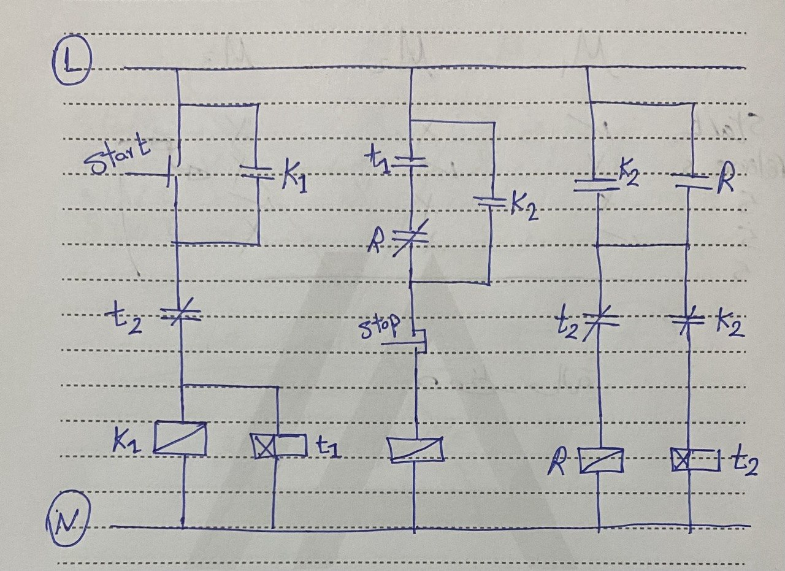

# Sequential-Contactor-Control-with-ON-Delay-Timers

##  Project Overview

This project implements a **sequential control system** using **two contactors (K1 and K2)** with **ON delay timers**.

The system demonstrates timing-based logic used in industrial automation.

---

##  Functional Requirements

* Press **Start**:

  * K1 turns ON immediately
  * After 5 seconds → K2 turns ON

* Press **Stop**:

  * K2 turns OFF immediately
  * K1 turns OFF after 5 seconds delay

---

##  Components Used

* Contactor K1 (Main)
* Contactor K2 (Secondary)
* Timer Relay t1 (ON delay - 5s)
* Timer Relay t2 (ON delay - 5s)
* Start Push Button (NO)
* Stop Push Button (NC)

---

##  Control Logic Explanation

###  Start Sequence

1. Press Start → K1 is energized immediately
2. Timer t1 starts counting
3. After 5 seconds → K2 is energized

---

###  Stop Sequence

1. Press Stop:

   * K2 de-energizes immediately
2. Timer t2 is triggered
3. After 5 seconds → K1 de-energizes

---

##  Key Concepts

* Sequential control
* ON delay timers
* Time-based switching
* Industrial control logic

---

##  Circuit Diagram

---

##  Demo Video

---

##  How to Operate

1. Power ON system
2. Press Start → K1 starts immediately
3. Wait 5 seconds → K2 starts
4. Press Stop:

   * K2 stops immediately
   * K1 stops after 5 seconds

